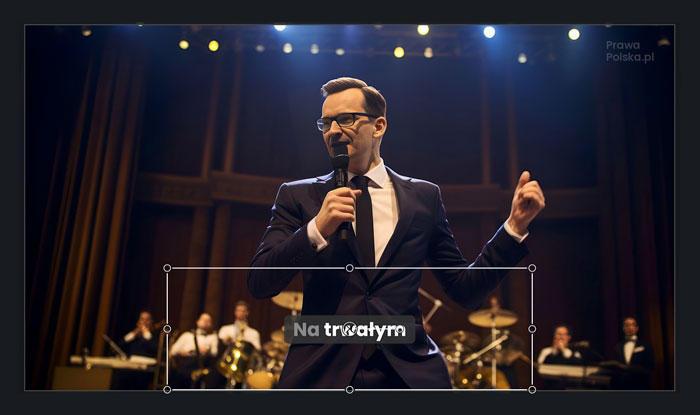

# `vid2captionsai`

`vid2captionsai` is a Python-based command-line tool designed to enhance your workflow with [captions.ai](https://www.captions.ai/), a platform for generating stylish, animated captions for your video content.

While captions.ai excels at burning subtitles directly into your video, `vid2captionsai` empowers users who seek greater control over the final subtitle integration. It helps you obtain the captions as a separate video layer with a transparent background. This allows you to import the captions into your preferred video editing software, where you can freely scale, position, trim, and composite them over your original footage exactly as you envision.

## Who is this for?

This tool is for content creators, video editors, and anyone using captions.ai who wants:

*   More flexibility in how captions are integrated into their final video.
*   To use professional video editing software to fine-tune the appearance and timing of captions alongside other video elements.
*   To maintain a non-destructive editing workflow, keeping subtitles as a separate, manageable layer.

## Why is it useful?

`vid2captionsai` bridges the gap between captions.ai's automated subtitle generation and the detailed control offered by video editing suites. The key benefits are:

*   **Control:** You get the animated subtitles as a standalone element.
*   **Flexibility:** Overlay, resize, and reposition subtitles in your video editor.
*   **Quality:** The `mask` command outputs to Apple ProRes 4444, a professional codec that supports alpha transparency, ensuring high-quality subtitles.
*   **Workflow Integration:** Fits smoothly into a standard video editing process.

## Installation

### Prerequisites

*   Python 3.10 or higher (for Python installation method).
*   `ffmpeg` and `ffprobe`: `vid2captionsai` bundles `ffmpeg` and `ffprobe` using `static-ffmpeg`, so you typically don't need to install them separately. However, if you have a specific version you'd like to use, ensure it's in your system's PATH or provide the path when using `vid2captionsai` programmatically.

### Option 1: Download Pre-built Binary (Recommended)

Download the latest binary for your platform from the [releases page](https://github.com/twardoch/vid2captionsai/releases):

- **Linux**: `vid2captionsai-linux-x64`
- **Windows**: `vid2captionsai-windows-x64.exe`
- **macOS**: `vid2captionsai-macos-x64`

Make the binary executable (Linux/macOS):
```bash
chmod +x vid2captionsai-linux-x64
./vid2captionsai-linux-x64 --help
```

### Option 2: Install from PyPI

To install the latest stable version from PyPI:

```bash
python3 -m pip install --upgrade vid2captionsai
```

### Option 3: Development Version

To install the latest development version directly from GitHub:

```bash
python3 -m pip install --upgrade git+https://github.com/twardoch/vid2captionsai
```

## Usage

`vid2captionsai` operates in a two-step process:

1.  **`blank` command:** Create a blank video with the audio from your original video. This blank video is then uploaded to captions.ai.
2.  **`mask` command:** After captions.ai processes the blank video and adds subtitles, you download it. The `mask` command then makes the background of this subtitled video transparent.

### Step 1: `blank` - Create a Blank Video for captions.ai

This command generates a new video file that has the same duration and audio track as your original video, but its visual track is a solid-colored background (defaulting to black and 2160x720 resolution).

**Command:**

```bash
vid2captionsai blank /path/to/your/original_video.mp4 [OPTIONS]
```

**Example:**

```bash
vid2captionsai blank my_interview.mp4 -c 000000 -w 1920 -h 1080
```

This creates `my_interview-blank.mp4` in the same directory. This new video will be 1920x1080, have a black background, and contain the audio from `my_interview.mp4`.

**Key Options for `blank`:**

*   `INPUT_PATH`: (Required) Path to your original video file.
*   `-c, --color <HEX>`: Background color in hexadecimal format (e.g., `000000` for black, `FFFFFF` for white). Default: `000000`.
*   `-w, --width <pixels>`: Width of the blank video. Default: `2160`.
*   `-h, --height <pixels>`: Height of the blank video. Default: `720`.

**Output:** A new video file named `[INPUT_PATH_STEM]-blank.mp4` (e.g., `original_video-blank.mp4`).

**Next Step:** Upload this `*-blank.mp4` file to [captions.ai](https://www.captions.ai/) (web or desktop app) and let it generate the subtitles. Download the resulting video from captions.ai. It will typically have the subtitles burned onto the blank background you specified. Let's assume captions.ai gives you `original_video-blank-subs.mp4`.

### Step 2: `mask` - Make Subtitle Background Transparent

This command processes the video you downloaded from captions.ai (the one with subtitles on a solid background). It makes the specified background color transparent, saving the result as a new video file with an alpha channel.

**Command:**

```bash
vid2captionsai mask /path/to/your/video-from-captions_ai.mp4 [OPTIONS]
```

**Example:**

```bash
vid2captionsai mask my_interview-blank-subs.mp4 -c 000000 -t 0.05 -o my_interview-transparent_subs.mov
```

This takes `my_interview-blank-subs.mp4`, makes the black (`000000`) background transparent (with a tolerance of `0.05` for near-black colors), and saves the output to `my_interview-transparent_subs.mov`.

**Key Options for `mask`:**

*   `INPUT_PATH`: (Required) Path to the video file downloaded from captions.ai (which has subtitles on a solid background).
*   `-c, --color <HEX>`: The background color to make transparent (should match the color used in the `blank` command). Default: `000000`.
*   `-t, --tolerance <float>`: Color tolerance for transparency. A higher value makes more shades of the target color transparent. Ranges from `0.01` (very strict) to `1.0` (very tolerant). Default: `0.01`.
*   `-f, --fps <integer>`: (Optional) Override the frames per second (FPS) for the output video. If not specified, it tries to use the input video's FPS.
*   `-o, --output_path <PATH>`: (Optional) Specify the full path for the output file. Default: `[INPUT_PATH_STEM]-mask.mov` (e.g., `video-from-captions_ai-mask.mov`).

**Output:** A new video file (typically `.mov` with Apple ProRes 4444 codec) containing only the subtitles with a transparent background. This video will **not** contain audio.

**Next Step:** Import this `*-mask.mov` (or your custom-named) transparent video into your video editing software. Place it on a track above your original video footage. You can now scale, position, and edit it as needed.

### Example Workflow Visualized

The following image illustrates the workflow:



1.  **Original Video:** Your source video footage.
2.  **`vid2captionsai blank`:** This command is used with your original video. It produces a "blank" video (e.g., black background, perhaps 2160x720 resolution, with the original audio).
3.  **Upload to captions.ai:** The "blank" video is uploaded to captions.ai, which generates and burns the animated subtitles onto this blank background.
4.  **Download from captions.ai:** You download the processed video from captions.ai. This video now has your subtitles on the solid-colored background.
5.  **`vid2captionsai mask`:** This command processes the video from captions.ai. It converts the solid background color (e.g., black) to transparency.
6.  **Import to Video Editor:** The resulting video (with transparent background and subtitles) is imported into your video editor. You can then layer it on top of your original video footage, scale it, and position it freely.

## Programmatic Usage

You can also use `vid2captionsai` in your Python scripts for automation or integration into larger workflows.

```python
from vid2captionsai import PrepAudioVideo
from pathlib import Path

# Initialize the processor
# You can optionally provide paths to your own ffmpeg and ffprobe binaries:
# prep = PrepAudioVideo(ffmpeg_path="/path/to/ffmpeg", ffprobe_path="/path/to/ffprobe")
prep = PrepAudioVideo(verbose=True) # Enable verbose logging for detailed output

# --- Example for the `blank` command ---
original_video_path = Path("my_cool_video.mp4") # Path to your original video

# Ensure the input video exists (for this example)
# In a real script, you'd get this path from user input or other logic
if not original_video_path.exists():
    print(f"Error: Input video not found at {original_video_path}")
    # Create a dummy file for example to run, if you don't have a video
    # with open(original_video_path, "w") as f: f.write("dummy video content")


blank_output_video_path = prep.blank(
    input_path=original_video_path,
    color="1A1A1A",  # Example: A dark gray background
    width=1920,      # Full HD width
    height=1080      # Full HD height
)
print(f"Blank video created at: {blank_output_video_path}")
# Next step: Upload the content of 'blank_output_video_path' to captions.ai.
# After captions.ai processing, download the video (e.g., as 'video-with-subs.mp4').

# --- Example for the `mask` command ---
# Path to the video downloaded from captions.ai (subtitles on solid background)
video_from_captions_path = Path("video-with-subs.mp4")

# Ensure the subtitled video exists (for this example)
if not video_from_captions_path.exists():
    print(f"Error: Subtitled video not found at {video_from_captions_path}")
    # Create a dummy file for example to run
    # with open(video_from_captions_path, "w") as f: f.write("dummy subtitled video content")

custom_output_name = Path("my_cool_video_transparent_captions.mov")
transparent_captions_video_path = prep.mask(
    input_path=video_from_captions_path,
    color="1A1A1A",  # Must match the color used for the blank video's background
    tolerance=0.03,  # Adjust tolerance as needed
    output_path=custom_output_name
)
print(f"Transparent captions video created at: {transparent_captions_video_path}")
# Next step: Import 'transparent_captions_video_path' into your video editor.
```

### Advanced Programmatic Initialization

When creating a `PrepAudioVideo` instance, you can specify:

*   `ffmpeg_path (str | Path | None)`: Path to a specific `ffmpeg` executable. If `None`, `static_ffmpeg`'s version is used.
*   `ffprobe_path (str | Path | None)`: Path to a specific `ffprobe` executable. If `None`, `static_ffmpeg`'s version is used.
*   `verbose (bool)`: Set to `True` for detailed logging output from `ffmpeg`/`ffprobe` during operations. Defaults to `False`.

## Technical Details

This section provides a deeper dive into how `vid2captionsai` works and guidelines for contributors.

### How the Code Works

`vid2captionsai` leverages `ffmpeg`, a powerful open-source multimedia framework, to perform video manipulations.

*   **Core Logic:** The main functionality resides in the `PrepAudioVideo` class within `src/vid2captionsai/vid2captionsai.py`.
*   **Command-Line Interface (CLI):** The CLI is powered by the `fire` library. `src/vid2captionsai/__main__.py` uses `fire` to expose the methods of the `PrepAudioVideo` class as subcommands (e.g., `blank`, `mask`).
*   **`ffmpeg` and `ffprobe` Integration:**
    *   The tool interacts with `ffmpeg` and `ffprobe` command-line tools using Python's `subprocess` module.
    *   It includes `static-ffmpeg` as a dependency. This package provides pre-compiled `ffmpeg` and `ffprobe` binaries for various platforms, ensuring the tool works out-of-the-box on supported systems without requiring users to manually install `ffmpeg`.
    *   If specific `ffmpeg` or `ffprobe` executables are needed (e.g., custom builds or different versions), their paths can be provided when instantiating the `PrepAudioVideo` class programmatically (see "Advanced Programmatic Initialization").

#### `blank` Method Internals

The `blank` method performs the following steps:

1.  **Path Preparation:** Resolves input and output paths. The output is named `[input_stem]-blank.mp4` by default.
2.  **Video Analysis (using `ffprobe`):**
    *   Extracts the `duration` of the input video using `ffprobe ... -show_entries format=duration ...`.
    *   Extracts the frame rate (`r_frame_rate`) of the input video stream using `ffprobe ... -show_entries stream=r_frame_rate ...`.
3.  **Video Generation (using `ffmpeg`):**
    *   A new video stream is generated using `ffmpeg`'s `lavfi` (filtergraph) input device with the `color` source filter:
        *   `ffmpeg -f lavfi -i "color=c={color}:s={width}x{height}:r={fps}:d={duration}" ...`
        *   This creates a video source of the specified hex `color`, `width`x`height` dimensions, calculated `fps`, and `duration`.
    *   The original audio stream from the input video is mapped to the new video using `-map` options:
        *   `-map 0:v:0`: Selects the video stream from the first input (the generated color source).
        *   `-map 1:a:0`: Selects the audio stream from the second input (the original video file).
    *   **Encoding:**
        *   Video codec: `libx264` (H.264).
        *   Audio codec: `aac`.
    *   `-shortest`: Ensures the output duration does not exceed the shortest input stream's duration (critical as the generated color source has a precise duration).
    *   The output is an MP4 container.

#### `mask` Method Internals

The `mask` method performs the following steps:

1.  **Path Preparation:** Resolves input and output paths. The output defaults to `[input_stem]-mask.mov` if not specified via the `-o` option.
2.  **Video Processing (using `ffmpeg`):**
    *   The core of this operation is `ffmpeg`'s `colorkey` video filter:
        *   `ffmpeg -i input_video ... -vf "colorkey=color=0x{color}:similarity={tolerance_float}:blend={tolerance_float}" ...`
            *   `color=0x{color}`: Specifies the target color to be made transparent (the user-provided hex color is prefixed with `0x`).
            *   `similarity`: This parameter is directly mapped from the user's `tolerance` argument (a float, e.g., `0.01`). A smaller value means only colors very close to the target will be transparent.
            *   `blend`: Also derived from the `tolerance` argument. This controls the smoothness of the edges of the keyed area, creating semi-transparent pixels for colors that are similar but not an exact match to the key color. This helps in achieving smoother anti-aliased edges for the captions.
    *   **Encoding:**
        *   Video codec: `prores_ks` (Apple ProRes 4444). This codec is chosen because it supports an alpha channel (for transparency) and is widely used in professional video workflows for high quality and good performance in editing software.
        *   Pixel format: `yuva444p10le` is often automatically selected with `prores_ks` when an alpha channel is present, storing YUV color with an alpha channel at 10 bits per component.
    *   Audio: The current implementation of the `mask` command **does not** copy or process audio from the input video. The output `.mov` file will be video-only, containing just the keyed subtitles.
    *   The output is a MOV container, suitable for ProRes and alpha transparency.

### Coding and Contributing

We welcome contributions to `vid2captionsai`! Help us make it even better.

*   **License:** The project is licensed under the Apache License 2.0. See `LICENSE.txt` for the full license text.
*   **Author:** `vid2captionsai` was created by Adam Twardoch. See `AUTHORS.md` for a list of contributors.
*   **Source Code & Issue Tracker:** [https://github.com/twardoch/vid2captionsai](https://github.com/twardoch/vid2captionsai)

#### Development Environment Setup

1.  **Prerequisites:**
    *   Python 3.10 or higher.
    *   Git.
2.  **Clone the repository:**
    ```bash
    git clone https://github.com/twardoch/vid2captionsai.git
    cd vid2captionsai
    ```
3.  **Create a virtual environment (recommended):**
    ```bash
    python3 -m venv .venv
    source .venv/bin/activate  # On Windows use: .venv\Scripts\activate
    ```
4.  **Install dependencies:**
    Install the package in editable mode (`-e`) along with testing dependencies:
    ```bash
    python3 -m pip install -e .[testing]
    ```
    This command reads dependencies from `pyproject.toml` and `setup.cfg` (specifically `install_requires` and `options.extras_require.testing`).

#### Code Style and Linting

*   The project uses `flake8` for linting. Configuration is in `setup.cfg` under the `[flake8]` section (e.g., `max_line_length = 88`).
*   Code formatting aims for compatibility with `black` (an opinionated code formatter).
*   We use `pre-commit` to automatically run checks (like `isort` for import sorting and `black` for formatting, if configured) before commits. To set it up:
    ```bash
    pip install pre-commit
    pre-commit install
    ```
    This will run hooks defined in `.pre-commit-config.yaml` on staged files during `git commit`.

#### Running Tests

Tests are written using Python's built-in `unittest` framework and are typically run using `pytest` for a better testing experience and more features.

To run all tests:

```bash
pytest
```

To run tests and generate a coverage report:

```bash
pytest --cov=src --cov-report=html  # Generates an HTML report in htmlcov/
```
(Ensure `pytest-cov` is installed via `pip install -e .[testing]`)

#### Contribution Process

1.  **Fork the repository** on GitHub to your personal account.
2.  **Create a new branch** in your fork for your feature or bugfix (e.g., `git checkout -b feature/add-new-output-format` or `bugfix/fix-color-parsing`).
3.  **Make your changes.** Write clean, well-commented code.
4.  **Add or update tests** for your changes to ensure they work as expected and to prevent regressions.
5.  **Run tests and linters** locally (`pytest`, `flake8`, `pre-commit run --all-files`) to ensure everything passes.
6.  **Commit your changes** with clear and descriptive commit messages. Follow conventional commit message formats if possible.
7.  **Push your branch** to your fork on GitHub: `git push origin your-branch-name`.
8.  **Open a Pull Request (PR)** from your branch in your fork to the `main` branch of the `twardoch/vid2captionsai` repository.
    *   Clearly describe the purpose of your PR, the changes you've made, and why they are beneficial.
    *   If your PR addresses an existing issue, please link to it in the PR description (e.g., "Fixes #123").

#### Key Dependencies

*   **`static-ffmpeg>=2.5`**: Bundles `ffmpeg` and `ffprobe` binaries, simplifying installation for end-users across different operating systems.
*   **`fire>=0.5.0`**: Facilitates the creation of the command-line interface from Python classes and methods with minimal boilerplate.

We look forward to your contributions!
